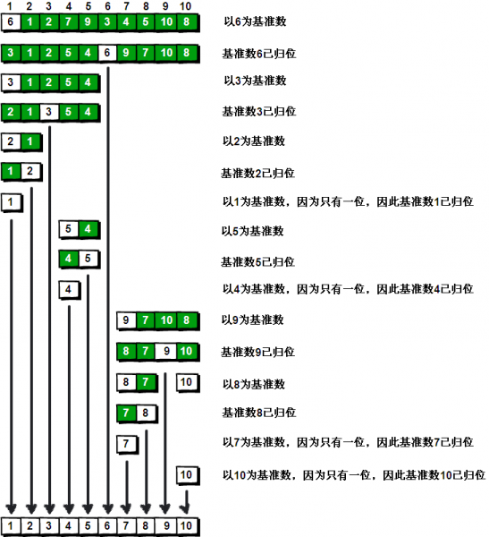

快速排序

假设我们现在对“**6 1 2 7 9 3 4 5 10 8**”这个 10 个数进行排序。首先在这个序列中随便找一个数作为基准数（不要被这个名词吓到了，就是一个用来参照的数，待会你就知道它用来做啥的了）。为了方便，就让第一个数 **6** 作为基准数吧。接下来，需要将这个序列中所有比基准数大的数放在 **6** 的右边，比基准数小的数放在 **6** 的左边，类似下面这种排列。

3 1 2 5 4 **6** 9 7 10 8

在初始状态下，数字 **6** 在序列的第 **1** 位。我们的目标是将 **6** 挪到序列中间的某个位置，假设这个位置是 **k**。现在就需要寻找这个 **k**，并且以第 **k** 位为分界点，左边的数都小于等于 **6**，右边的数都大于等于 **6**。

方法其实很简单：分别从初始序列“**6 1 2 7 9 3 4 5 10 8**”两端开始“探测”。先从**右**往**左**找一个小于 **6** 的数，再从**左**往**右**找一个大于 **6** 的数，然后交换他们。这里可以用两个变量 **i** 和 **j**，分别指向序列最左边和最右边。我们为这两个变量起个好听的名字“哨兵 i”和“哨兵 j”。刚开始的时候让哨兵 i 指向序列的最左边（即 **i=1**），指向数字 **6**。让哨兵 **j** 指向序列的最右边（即 **j=10**），指向数字 **8**。


首先哨兵 **j** 开始出动。因为此处设置的基准数是最左边的数，所以需要让哨兵 **j** 先出动，这一点非常重要（其实也不一定）。哨兵 **j** 一步一步地向左挪动（即 **j--**），直到找到一个小于 **6** 的数停下来。接下来哨兵 **i** 再一步一步向右挪动（即 **i++**），直到找到一个数大于 **6** 的数停下来。最后哨兵 **j** 停在了数字 **5** 面前，哨兵 **i** 停在了数字 **7** 面前。


现在交换哨兵 **i** 和哨兵 **j** 所指向的元素的值。交换之后的序列如下。

6 1 2 **5** 9 3 4 **7** 10 8


到此，第一次交换结束。接下来开始哨兵 **j** 继续向左挪动（再友情提醒，每次必须是哨兵 **j** 先出发）。他发现了 **4**（比基准数 **6** 要小，满足要求）之后停了下来。哨兵 **i** 也继续向右挪动的，他发现了 **9**（比基准数 **6** 要大，满足要求）之后停了下来。此时再次进行交换，交换之后的序列如下。

6 1 2 5 **4** 3 **9** 7 10 8

第二次交换结束，“探测”继续。哨兵 **j** 继续向左挪动，他发现了 **3**（比基准数 **6** 要小，满足要求）之后又停了下来。哨兵 **i** 继续向右移动，糟啦！此时哨兵 **i** 和哨兵 **j** 相遇了，哨兵 **i** 和哨兵 **j** 都走到 **3** 面前。说明此时“探测”结束。我们将基准数 **6** 和 **3** 进行交换。交换之后的序列如下。

**3** 1 2 5 4 **6** 9 7 10 8


到此第一轮“探测”真正结束。此时以基准数 **6** 为分界点，**6** 左边的数都小于等于 **6**，**6** 右边的数都大于等于 **6**。回顾一下刚才的过程，其实哨兵 **j** 的使命就是要找小于基准数的数，而哨兵 **i** 的使命就是要找大于基准数的数，直到 **i** 和 **j** 碰头为止。

OK，解释完毕。现在基准数 **6** 已经归位，它正好处在序列的第 **6** 位。此时我们已经将原来的序列，以 **6** 为分界点拆分成了两个序列，左边的序列是“**3 1 2 5 4**”，右边的序列是“ **9 7 10 8** ”。接下来还需要分别处理这两个序列。因为 **6** 左边和右边的序列目前都还是很混乱的。不过不要紧，我们已经掌握了方法，接下来只要模拟刚才的方法分别处理 **6** 左边和右边的序列即可。现在先来处理 **6** 左边的序列现吧。

左边的序列是“**3 1 2 5 4**”。请将这个序列以 **3** 为基准数进行调整，使得 **3** 左边的数都小于等于 **3**，**3** 右边的数都大于等于 **3**。好了开始动笔吧。

如果你模拟的没有错，调整完毕之后的序列的顺序应该是。

2 1 **3** 5 4

OK，现在 **3** 已经归位。接下来需要处理 **3** 左边的序列“ **2 1** ”和右边的序列“**5 4**”。对序列“ **2 1** ”以 **2** 为基准数进行调整，处理完毕之后的序列为“**1 2**”，到此 **2** 已经归位。序列“**1**”只有一个数，也不需要进行任何处理。至此我们对序列“ **2 1** ”已全部处理完毕，得到序列是“**1 2**”。序列“**5 4**”的处理也仿照此方法，最后得到的序列如下。

1 2 3 4 5 6 9 7 10 8

对于序列“**9 7 10 8**”也模拟刚才的过程，直到不可拆分出新的子序列为止。最终将会得到这样的序列，如下。

1 2 3 4 5 6 7 8 9 10

到此，排序完全结束。细心的同学可能已经发现，快速排序的每一轮处理其实就是将这一轮的基准数归位，直到所有的数都归位为止，排序就结束了。下面上个霸气的图来描述下整个算法的处理过程。



快速排序之所比较快，因为相比冒泡排序，每次交换是跳跃式的。每次排序的时候设置一个基准点，将小于等于基准点的数全部放到基准点的左边，将大于等于基准点的数全部放到基准点的右边。这样在每次交换的时候就不会像冒泡排序一样每次只能在相邻的数之间进行交换，交换的距离就大的多了。因此总的比较和交换次数就少了，速度自然就提高了。当然在最坏的情况下，仍可能是相邻的两个数进行了交换。因此快速排序的最差时间复杂度和冒泡排序是一样的都是 **O(N2)**，它的平均时间复杂度为 **O(NlogN)**。其实快速排序是基于一种叫做“二分”的思想。

代码（C++)：

```cpp
#include<iostream>
#include<vector>
#pragma warning(disable:4996)
using namespace std;

vector<int> v = { 2, 4, 6, 8, 10, 1, 3, 5, 9, 7 };

void quicksort(int left, int right)
{
	int i = left, j = right, temp;
	if (left > right)
		return;
	temp = v[left];
	
	//temp取的是左边的值，因此要从右边开始找
	while (i!=j)
	{
		while (v[j] >= temp && i < j)
			j--;
		while (v[i] <= temp && i < j)
			i++;
		if (i < j)
			swap(v[i], v[j]);
	}
	//最终将基数归位
	v[left] = v[i];
	v[i] = temp;
	quicksort(left, i - 1);			//继续处理左边的
	quicksort(i + 1, right);		//继续处理右边的
}

int main()
{
	quicksort(0, v.size() - 1);

	for (int i = 0; i < v.size(); i++)
	{
		cout << v[i] << ' ';
	}
	cout << endl;
	system("pause");
	return 0;
}
```

先来解释一下为什么要先移动左边的数：

以数列`2 1 4 7`为例，如果选择基准数`2`，并先移动右边的数，`i`将先移动到`4`，随后`j`也移动到`4`，由于不满足`i<j`，所以不交换，最后跳出循环，把基数归位时，是`2`和`4`进行交换，变成了`4 1 2 7`，出现错误。

再来解释一下为什么先移动右边的数也行：

先移动哪边取决于循环判断条件，如下代码中，则是先移动右边的：

```cpp
#include<iostream>
#include<vector>
#pragma warning(disable:4996)
using namespace std;

vector<int> v = { 2, 4, 6, 8, 10, 1, 3, 5, 9, 7 };

void quicksort(int left, int right)
{
	int i = left, j = right, temp;
	if (left > right)
		return;
	temp = v[left];

	while (i <= j)					//注意这里的条件是<=
	{
		while (i <= j && v[i] <= temp)
			i++;
		while (i <= j && v[j] >= temp)
			j--;
		if (i < j)
			swap(v[i++], v[j--]);
		else
			i++;
	}
	//最终将基数归位
	v[left] = v[j];					//注意这里是j
	v[j] = temp;					//注意这里是j
	quicksort(left, j - 1);			//继续处理左边的，注意这里是j
	quicksort(j + 1, right);		//继续处理右边的，注意这里是j
}

int main()
{
	quicksort(0, v.size() - 1);

	for (int i = 0; i < v.size(); i++)
	{
		cout << v[i] << ' ';
	}
	cout << endl;
	system("pause");
	return 0;
}
```

挖坑法：

另外一种比较好理解的是挖坑法。仍然选择最左边的作为基数，只不过在选择之后认为这个地方是个坑，由于是在左边挖的坑，所以需要从右边选择一个数来填上，这时候就要从右往左选择第一个小于基数的数来填上这个坑。

在填上这个坑之后，认为原来的地方又是一个新坑，所以需要从左往右选择第一个大于基数的数填上。

以此类推。

代码（C++）：

```cpp
#include<iostream>
#include<vector>
#pragma warning(disable:4996)
using namespace std;

vector<int> v = { 4, 3, 7, 9, 5, 8, 1, 2, 6, 10 };

void quicksort(int left, int right)
{
	int i = left, j = right, temp;
	if (left > right)
		return;
	temp = v[left];

	while (i < j)
	{
		while (i < j && v[j] >= temp)
			j--;
		if (i < j)
			v[i] = v[j];
		while (i < j && v[i] <= temp)
			i++;
		if (i < j)
			v[j] = v[i];
	}
	//最终将基数归位
	v[i] = temp;					//注意这里是i
	quicksort(left, i - 1);			//继续处理左边的，注意这里是j
	quicksort(i + 1, right);		//继续处理右边的，注意这里是j
}

int main()
{
	quicksort(0, v.size() - 1);

	for (int i = 0; i < v.size(); i++)
	{
		cout << v[i] << ' ';
	}
	cout << endl;
	system("pause");
	return 0;
}
```

另外给出一种基数选择不是选左边的数，而是选择中间的数的快排。

由于选择的是中间的数，所以就不存在最后再确定位置的情况了，直接每次迭代的时候都把数组分为左边全都小于基数，右边全都大于基数的情况。

由于只是左右部分进行相互交换，所以先搜左边还是先搜右边都是可以的。

```cpp
#include<iostream>
#include<vector>
#pragma warning(disable:4996)
using namespace std;

vector<int> v = { 4, 3, 7, 9, 5, 8, 1, 2, 6, 10 };
void quicksort(int left, int right)
{
	int i = left, j = right, temp;
	if (left >= right)
		return;
	temp = v[(left+right)/2];

	while (i <= j)
	{
		while (v[i] < temp)
			i++;
		while (v[j] > temp)		//这里无先后顺序的要求，先i或者先j都可以
			j--;
		if (i <= j)
			swap(v[i++], v[j--]);
	}
	quicksort(left, j);			//继续处理左边的，注意这里是j
	quicksort(i, right);		//继续处理右边的，注意这里是i
}

int main()
{
	quicksort(0, v.size() - 1);

	for (int i = 0; i < v.size(); i++)
	{
		cout << v[i] << ' ';
	}
	cout << endl;
	system("pause");
	return 0;
}
```


-----

引用：

1. <http://wiki.jikexueyuan.com/project/easy-learn-algorithm/fast-sort.html>
2. <https://blog.csdn.net/chinalwb/article/details/9295527>

致谢：

杨凯，杨崇志