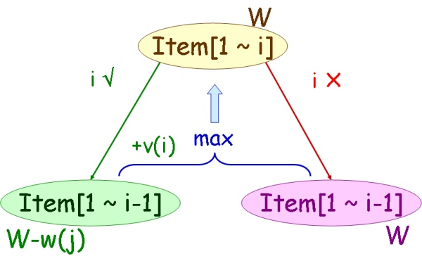

# 题目描述

给定一组物品，一共$n$个，每件物品都有自己的重量（$weight$）和价值（$value$），给定一个最大承重为$C$的背包，每个物品可以选择拿或者不拿，问这个背包最多能带走的最多的物品总价值是多少

# 问题分析

贪婪算法是无法求最优解的。

背包问题具有最优子结构性质，所谓最优子结构性质是指一个问题的最优解中所包含的所有子问题的解都是最优的。所以可以用动态规划求解。

定义子问题$P(i, W)$为在前$i$个物品总挑选总重量不超过$W$的物品，每种物品最多只能选一个，使总价值最大。

考虑第$i$个物品，就两个选择：选或者不选。

不选的话，背包的容量不变，变成子问题：$P(i-1, W)$

选的话，背包容量变小，变成子问题：$P(i-1, W-w_i)$，当然，此时背包内的商品价值变高。

最优的方案就是比较这两个方案，哪个背包里面的价值更高。

定义$m(i, W)$为在$P(i, W)$下的最大价值。那么有：

$$
m(i, W)=max(m(i-1,W),m(i-1,W-w_i)+v_i)
$$



另外考虑到边界情况，最后得到的解体公式是：
$$
m(i, W)=\left\{\begin{array}{ll}0 & \text { if } i=0 \\ 0 & \text { if } W=0 \\ m(i-1, W) & \text { if } w_{i}>W \\ \max \left\{m(i-1, W), v_{i}+m\left(i-1, W-w_{i}\right)\right\} & \text { otherwise }\end{array}\right.
$$
# 例

有5个物品，（重量，价值）分别为：（5，12），（4，3），（7，10），（2，3），（6，6）。

有如下递推表格：

| 背包容量  | 0    | 1    | 2    | 3    | 4    | 5    | 6    | 7    | 8    | 9    | 10   | 11   | 12   | 13   | 14   | 15   |
| --------- | ---- | ---- | ---- | ---- | ---- | ---- | ---- | ---- | ---- | ---- | ---- | ---- | ---- | ---- | ---- | ---- |
| 最多放5件 | 0    | 0    | 0    | 0    | 0    | 0    | 6    | 12   | 12   | 15   | 15   | 18   | 22   | 22   | 25   | 25   |
| 最多放4件 | 0    | 0    | 3    | 3    | 3    | 3    | 3    | 12   | 12   | 15   | 15   | 18   | 22   | 22   | 25   | 25   |
| 最多放3件 | 0    | 0    | 0    | 0    | 0    | 0    | 0    | 12   | 12   | 15   | 15   | 15   | 22   | 22   | 22   | 22   |
| 最多放2件 | 0    | 0    | 0    | 0    | 3    | 12   | 12   | 12   | 12   | 15   | 15   | 15   | 15   | 15   | 15   | 15   |
| 最多放1件 | 0    | 0    | 0    | 0    | 0    | 12   | 12   | 12   | 12   | 12   | 12   | 12   | 12   | 12   | 12   | 12   |

代码：

```cpp
#include <bits/stdc++.h>
#pragma warning(disable:4996)
using namespace std;

int main()
{
	int w[6] = { 0,5,4,7,2,6 };
	int v[6] = { 0,12,3,10,3,6 };
	int n = 5;		//有5个物品
	int C = 15;		//假定背包的最大容量为15
	vector<vector<int>> dp(n+1);
	for (int i = 0; i < n+1; i++)
	{
		dp[i].resize(C + 1);
	}
	for (int i = 1; i <= n; i++)
	{
		for (int j = 0; j <= C; j++)
		{
			if (j < w[i])		//放不下
				dp[i][j] = dp[i - 1][j];
			else
				dp[i][j] = max(dp[i - 1][j], dp[i - 1][j - w[i]] + v[i]);
		}
	}
	cout << dp[n][C] << endl;
	system("pause");
	return 0;
}

```

时间复杂度：$O(Cn)$，$C$表示背包的容量，$n$表示物品的数量。时间复杂度不能在优化了

空间复杂度：空间复杂度是可以优化到$O(C)$

在优化时间复杂度的时候，肯定有一个主循环$i=1...n$，每次算出来二维数组$dp[i][0...C]$的所有值。如果想只用一个数组，那么需要保证第$i$次循环结束之后，$dp$中保存的是$dp[i]$。

又由于$dp[i][j]$是由$dp[i-1][j]$和$dp[i-1][j-w[i]]$这两个子问题递推而来，所以可以采用一位数组，但是从$C...0$的顺序递推$dp[i]$，这样可以保证计算$dp[i]$时，$dp[i]$现有的值是$dp[i-1][j]$，$dp[j-w[i]]$是$dp[i-1][j-w[i]]$。

所以代码如下：

```cpp
#include <bits/stdc++.h>
#pragma warning(disable:4996)
using namespace std;

int main()
{
	int w[6] = { 0,5,4,7,2,6 };
	int v[6] = { 0,12,3,10,3,6 };
	int n = 5;		//有5个物品
	int C = 15;		//假定背包的最大容量为15
	vector<int> dp(C + 1);
	for (int i = 1; i <= n; i++)
	{
		for (int j = C; j > w[i]; j--)
		{
			dp[j] = max(dp[j], dp[j - w[i]] + v[i]);
		}
	}
	cout << dp[C] << endl;
	system("pause");
	return 0;
}

```

关于01背包问题，有两种问法：要求恰好装满背包，或者只是希望价值尽可能的大。

如果是恰好装满背包，则在初始化的时候，要把除了$dp[0]=0$其他的$dp[1...C]= -∞$。

如果是价值尽可能的大，初始化的时候$dp[0...C]=0$

